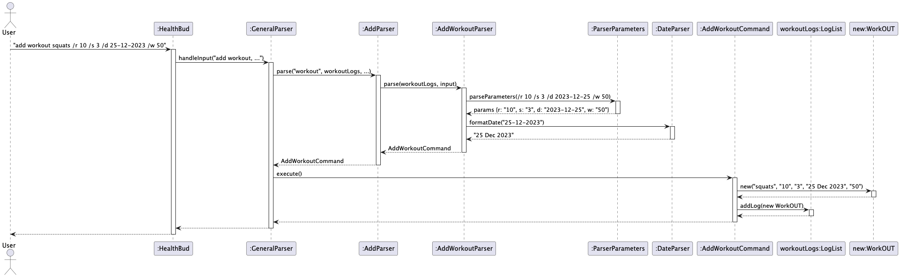

# Developer Guide

## Acknowledgements

This application was developed as part of a university software engineering module CS2113. Some ideas were adapted from:
1. Duke Java Project
2. JavaFX Documentation
3. Official Java 17 Documentation

## Design

### Architecture

`//include architecture diagram here`

The Architecture Diagram given above explains the high-level design of the HealthBud.

Given below is a quick overview of main components and how they interact with each other.

**Main Components**

`HealthBud` is in charge of the CLI to launch and the exit.

- At CLI launch, it initializes the other components in the correct sequence, and connects them up with each other.
- At exit, it shuts down the other components and invokes cleanup methods where necessary.

The bulk of the CLI's work id done by the following components:

- [**`UI`**](#ui): Responsible for displaying messages to the user.
- [**`Parser`**](#parser): Interprets user commands and constructs the corresponding `Command` objects.
- [**`Command`**](#command): Contains the logic for executing user commands.
- [**`LogList`**](#loglist): **(New)** Maintains lists for each log type (Meal, Workout, Water, etc.).
- [**`Storage`**](#storage): Handles reading and writing data to and from the hard disk.
- [**`Data`**](#data): Holds the in-memory data (logs) of the app.

### UI

  

- The UI component is responsible for user interactions. It handles displaying messages, prompts, and error messages to the user. 

### Parser

The Parser interface uses a series of classes to implement the various commands.

### Command
`//TODO: include command class diagram here`

### LogList

The LogList class manages a list of logs, each representing a fitness-related entry such as meals, workouts, water 
intake, cardio sessions, personal bests, or goals. It maintains a List<Log> and provides methods to add, delete, update,
list, and search through these logs.

- The abstract Log class is the superclass for all log types.
- Subclasses like Meal, Workout, Water, Cardio, PersonalBest, and Goals extend Log and store specific data for each log type.
- LogList has a one-to-many association with Log, represented by the contains relationship.
- The Goals class follows a singleton pattern via getInstance() and stores user-defined fitness goals.

This design promotes extensibility and encapsulation, allowing new log types to be added easily while maintaining a consistent interface.

### Storage
`//TODO: include command class diagram here`

### Data
`//TODO: include command class diagram here`

# Implementation

## Add Log Command
`//TODO: include SD here`

## Delete Log Command
The delete log feature allows users to remove a log by its index from the application's log list. This feature is handled by the `DeleteCommand` class, which performs validation, deletion, and error handling.

### 1. User Input:  
   - The user enters the delete command followed by the log's index (e.g., `delete meal 3`).

### 2. Command Parsing:  
   - The Parser converts the input into a `DeleteCommand` object, adjusting the index to match the list’s 0-based indexing. This process is handled by the `ParserManager` and the `DeleteParser.`

### 3. The `DeleteCommand` executes as follows:  
   - Validation: Verifies whether the specified index is valid and corresponds to an existing meal log.

   - Error Handling: If the index is invalid, an error message is returned to the user.

   - Deletion: If the index is valid, the command retrieves the log’s details, removes the log from the Logs list, and generates a success message.

### 4. How the feature is implemented:  
   - The deletion functionality is handled by the DeleteCommand class. It validates the user-provided index, adjusts it to match the 0-based indexing of the log list, and performs the deletion on the LogList object. This keeps the deletion logic isolated, making it easier to maintain and test.

### 5. Why it is implemented that way:  
    - Using a dedicated command class follows the Command Pattern, which separates concerns effectively. Isolating deletion logic into its own class adheres to the Single Responsibility Principle, simplifying debugging and future enhancements without impacting other parts of the system.

### 6. Alternatives considered:  
    - One alternative was to embed the deletion logic directly in the parser or UI layer. However, this approach would mix user input handling with business logic, resulting in code that is harder to maintain and test. Delegating deletion to a specialized command class keeps the design modular and scalable.

### Sequence Diagram

Diagram Explanation  

1. User Input:  
   - The user enters `delete meal 3` in the CLI.

2. Parsing:  
   - `HealthBud` receives the command and passes it to the `GeneralParser`.
   - The `GeneralParser` calls `DeleteParser`, which extracts the log type ("meal") and the index (3). The index is then adjusted for 0-based indexing.
   - A `DeleteCommand` object is created and returned to the `GeneralParser`.

3. Command Execution:  
   - The `GeneralParser` invokes `execute()` on the `DeleteCommand`.
   - The `DeleteCommand` calls `deleteLog(2)` on the `mealLogs` (since index 3 from the user corresponds to index 2 internally).
   - The log is deleted from the `mealLogs`, and a success message is generated.

4. Outcome:  

   - If the index is invalid, the command returns an error message.

   - If the index is valid, the meal log is removed and a success message is displayed to the user.

This clear separation of user input, command parsing, and execution ensures that the deletion operation is handled in a structured and predictable manner.

## Recommend

### 1. Feature overview
The recommend <muscle_group> command provides users with 3 curated workout suggestions based on the specified muscle group, helping users diversify their fitness routines.
### 2. Implementation details
- RecommendParser handles parsing and validation of user input.
- Based on the muscle group, it creates a RecommendCommand with the appropriate message.
- RecommendCommand is responsible solely for displaying the recommendation using Ui.printMessage().

### 3. Why this design
- Separation of Concerns: Logic for parsing and message generation is in the parser, while command execution is kept simple and focused.
- Testability: Easy to write unit tests for RecommendParser without needing to simulate UI output.
- Readability: Clean execute() method and well-structured parser make the code intuitive and maintainable

### 4. Alternatives considered
- Enums for muscle groups: More structured but restrictive; dropped in favor of flexible string matching.
- External file storage for recommendations: Overhead for static data; current implementation is simpler and faster.

### 5. Sequence Diagrams

Diagram Explanation  

1. User Input: The user enters recommend <muscle_group> in the CLI.
2. Parsing: RecommendParser parses the input and creates a RecommendCommand with a list of exercises.
3. Command Execution: RecommendCommand.execute() is called. It sends the exercise list to Ui to display.
4. Outcome:  
An alt block handles:
- Valid Input: The recommended exercises are displayed and a success message is returned.
- Invalid Input: An exception is thrown and an error message is shown to the user.

This structure clearly separates parsing, command creation, and UI interaction for robust handling.

### 6. Future Improvements
- Move recommendations to a config/JSON file for easier updates without modifying source code.
- Support partial string matches and synonyms for better UX.

## BMICommand

### 1. Feature overview:
The **BMICommand** feature allows users to calculate their Body Mass Index (BMI) and receive a classification (e.g., underweight, normal weight, overweight, obese). It’s useful for users who want a quick health metric based on their height and weight inputs.
### 2. Implementation details:
Inherits from InputOnlyCommand (which in turn extends the base Command class) to handle input parsing.

Stores weight and height as immutable (final) fields.
### 3. Why this design:
Single Responsibility:
The BMI calculation is isolated in its own command, keeping the logic clean and focused.

Readability & Testability:
The concise code structure makes it easy to unit test and maintain.

Extensibility:
Future changes (e.g., additional BMI categories or metrics) can be made in this class without impacting other parts of the system.
###  4. Alternatives considered:
online Calculation in the Parser

Implementing BMI logic directly in the parser would mix concerns and lead to a more complex parser design.

Using an External Library

Given the simplicity of the BMI formula, an external library would add unnecessary complexity.

5. Sequence Diagrams
6. Future Improvements

## SearchCommand
### 1. Feature overview:
The SearchCommand feature allows users to search through their logs by either a specific date or a keyword. This enables users to quickly filter and locate log entries—for example, finding all logs on a particular day or identifying entries that mention a specific term.
### 2. Implementation details:
#### Inheritance:
Inherits from OneLogCommand (which in turn extends the base Command class) to operate on a single LogList.
#### Immutable Fields:
Stores the search parameters (either date or keyword) as immutable (final) fields.
#### Dual Search Logic:
implements two search approaches:
1. **Keyword Search**: Searches through the log entries for a specific keyword.
2. **Date Search**: Filters log entries based on a specific date.
### 3. Why this design:
Single Responsibility:
The search functionality is isolated within its own command, ensuring the logic is clean, focused, and easy to manage.

Readability & Testability:
The clear separation between date-based and keyword-based searches simplifies both understanding and unit testing.

Extensibility:
Future enhancements—such as combining filters or adding new search criteria—can be integrated with minimal changes to the existing structure.
Readability & Testability:
The concise code structure makes it easy to unit test and maintain.

Extensibility:
Future changes (e.g., additional BMI categories or metrics) can be made in this class without impacting other parts of the system.
###  4. Alternatives considered:
Extending AllLogsCommand:
One alternative was to have the search functionality span multiple log types simultaneously by extending AllLogsCommand. However, this approach was rejected because it would complicate the search logic and user interface. Users typically search within a single log category, so isolating the search to one log list made the command simpler and clearer.

Parser-Only Filtering:
Another alternative was to handle filtering entirely within the parser, returning a filtered list rather than a command that executes a search. This was not chosen because encapsulating the search behavior in a dedicated command class improves separation of concerns and aligns with the command-based architecture used throughout the project.

5. Sequence Diagrams 
### Future Improvements
Combined Search Criteria:
Future enhancements could allow users to combine search parameters (e.g., filtering by both date and keyword simultaneously) to refine their search results further.

Advanced Filtering Options:
Implementing range-based date searches, fuzzy matching for keywords, or even categorizing results by relevance could improve user experience.

Result Ranking & Pagination:
For logs with many entries, adding functionality to rank results by relevance or paginate long lists could enhance usability.

Improved Logging & Metrics:
Incorporating logging of search queries and performance metrics could help monitor usage patterns and optimize search efficiency in future releases.

## AddWorkoutCommand
### 1. Feature overview

The AddWorkoutCommand allows users to track their strength training exercise in the HealthBud application.
This feature captures five key pieces of information for each workout session:
The name of the exercise, the weight done in Kg, the number of repetitions performed, the number of sets completed, and the date of the workout.
The system stores these records in a dedicated workout log list that users can view, modify, or analyze over time.

Users interact with this feature through a structured command format:
`add workout` [Workout_name] /w [weight in Kg] /r [number of reps] /s [number of sets] /d [date]

### 2. Implementation details

When users enter an "add workout" command, the system follows a defined sequence of operations to ensure proper recording of exercise data.
The process begins with the GeneralParser, which identifies the command type and directs workout entries to the specialized AddWorkoutParser.
This dedicated parser performs comprehensive validation of three required parameters:
the weight done in kg (/w) repetition count (/r), set count (/s), and workout date (/d).
Each parameter undergoes strict format checking - repetitions and sets must be positive integers, while the date must follow a valid, recognizable format.
For the workout name, the system extracts all text preceding the first parameter marker while ensuring it contains valid characters
During command execution, the system instantiates a new WorkOUT object with the verified parameters.
This immutable data object is then added to the application's centralized workout log.
All exceptions, including invalid numeric values or date formats, are caught and presented to users as actionable error messages.
### 3. Why this design

The current implementation follows several key design principles to ensure robustness and maintainability.
The command pattern was deliberately chosen to create a clear separation between parsing user input and executing commands.
This architectural decision makes the system more modular, allowing individual workout commands to be modified or extended without affecting other components.

Parameter processing follows a flexible yet strict validation approach.
By using dedicated markers (/w, /r, /s, /d), the system accommodates natural variations in command entry while maintaining rigorous data quality standards.
This design choice significantly improves user experience by accepting parameters in any order, rather than enforcing a rigid sequence.

The WorkOUT class implements an immutable design pattern for important reliability benefits.
Once created, workout records cannot be accidentally modified, which prevents data corruption and simplifies debugging.
This immutability also enables thread-safe operations, future-proofing the application for potential multi-threaded enhancements.

The parsing logic incorporates multiple validation layers for maximum data integrity.
Each parameter undergoes type checking, format verification, and range validation before being accepted.
This thorough validation occurs before any changes to application state, following the fail-fast principle to prevent partial or invalid updates.
### 4. Alternatives considered

We initially considered using positional arguments rather than parameter markers,
where users would enter values in a fixed order (e.g., "add workout [name] [weight] [reps] [sets] [date]").
This approach was ultimately rejected because it proved less intuitive for users and more prone to input errors.
The current marker-based system (/w, /r, /s, /d) provides clearer visual separation of parameters and allows for more flexible command entry.

We also explored using a single unified Log class with type differentiation,
rather than dedicated classes for each log type.
This unified approach was abandoned because it would have required extensive runtime type checking and reduced type safety.
The current specialized class structure provides better compile-time checks and more intuitive code organization.

### 5. Sequence Diagrams

### 6. Future Improvements
The weight tracking functionality will be enhanced to support more advanced strength training scenarios.
This will include the ability to record varying weights within a single workout session, such as pyramid sets or drop sets, through an expanded command syntax.

## Goals
### 1. Feature Overview

The Goals feature allows users to set and view personalized health goals within the chatbot. These include:
Daily Water Intake Goal (/w), Daily Calorie Intake Goal (/cal), Weight Goal (/kg)

### 2. Implementation Details

The add goal command is implemented in the main parser logic using a switch statement. Here's how it works:

- When the user enters add goal /w [value] /cal [value] /kg [value], the input is parsed using AddGoalParser.
- If any parameters are missing (e.g., no /cal provided), they are auto-filled using the current values stored 
in the Goals singleton instance.
- ParserParameters extracts the parameters into a key-value map.
- AddGoalCommand is then created with the parsed values and executed.
- If the values differ from the current ones, Goals.updateGoals() updates the stored values, and the goal is 
logged to the goalLogs list.
- Track function (called with track goal /d <date>) as well as the view function (called with view goal) are 
supplementary functions provided to increase the accountability of the user by giving him easy access to previous and
current stats.

Exceptions such as InvalidGoalException and InvalidDateFormatException are handled gracefully to ensure robustness.

### 3. Why This Design
- Simplicity: A single command (add goal) handles all updates in one go, keeping the interaction concise 
and easy to use.
- Singleton Pattern: Using Goals.getInstance() ensures centralized access to the current user goals across the app.
- Auto-Fill Support: Missing parameters default to current goal values, streamlining repeated updates.
- Separation of Concerns: Goal parsing and updating are kept modular and separate from logging and UI logic

### 4. Alternatives Considered
- Command Pattern: We considered creating individual commands for each goal type (e.g., SetWaterGoalCommand), 
but found a unified approach more straightforward for the CLI.
- Interactive CLI Loop: Earlier versions used a conversational loop for goal editing, but it was replaced by a 
single-line command to reduce complexity.
- Persistent Storage: While current goal data is stored in-memory and appended to the log file, we plan to enhance 
persistence for full session retention.

### 5. Sequence Diagrams

### 6. Future Improvements
- Input Validation: Use regex or stricter parsing to ensure only valid integers are accepted.
- Persistent Goal Storage: Store and reload goals from file or database to retain state between sessions.
- Multi-User Support: Refactor the singleton Goals class to support different profiles.
- Goal Recommendations: Use history from logs (e.g., average water intake) to suggest realistic goal values

## Product scope
### Target user profile

1. Fitness-conscious individuals
2. Users who prefer CLI-based tools
3. Individuals who want to log workouts, meals, water intake, and progress
4. Java users with basic terminal skills

### Value proposition

HealthBud provides a simple and effective CLI solution to track health logs including workouts, meals, water intake,
and personal bests. Unlike complex mobile apps, it runs offline and keeps the data lightweight and easily exportable.

## User Stories

|Version| As a ...           | I want to ...                                         | So that I can ...                                        |
|--------|-------------------|--------------------------------------------------------|-----------------------------------------------------------|
|v1.0   | new user           | see usage instructions                                | refer to them when I forget how to use the app           |
|v1.1   | user               | add workout logs                                      | track my workout progress                                |
|v1.2   | user               | record meal entries                                   | track calorie intake                                     |
|v1.3   | user               | input water logs                                      | ensure I stay hydrated                                   |
|v1.4   | user               | record my personal bests                              | see strength improvements over time                      |
|v2.0   | fitness enthusiast | get workout recommendations by muscle group          | try targeted exercises for specific body parts           |
|v2.1   | user               | calculate BMI                                         | know if I’m in a healthy weight range                    |
|v2.2   | user               | summarize daily intake                                | get a quick overview of my calories and hydration        |
|v2.3   | user               | view logs by date                                     | track my daily progress easily                           |
|v2.4   | user               | clear logs by category                                | declutter and keep only relevant data                    |
|v2.5   | user               | set fitness goals                                     | stay motivated and focused on my targets                 |

## Non-Functional Requirements

1. Should work on any platform with Java 17 or above
2. CLI response time under 1 second
3. Saves data locally in .txt file format
4. Commands should follow a consistent, predictable format
5. Lightweight and offline-capable (no external database or network dependency)

## Glossary

1. CLI – Command Line Interface
2. SUT – System Under Test
3. BMI – Body Mass Index
4. PB – Personal Best
5. Log – A record of user data (e.g., workout, meal, water)
6. Command – A user-triggered action that HealthBud performs
7. Parser – Component that interprets user input and returns a corresponding command

## Instructions for manual testing
### Prerequisites

1. Java 17 or later installed
2. HealthBud.jar built or downloaded

### Running the Program

1. Ensure that you have Java 17 or above installed.
2. Download the latest version of HealthBud from here.
3. Open a terminal and navigate to the folder where the application is located.
4. Run java -jar HealthBud.jar to start the application.
5. Start entering commands to log your fitness activities!
