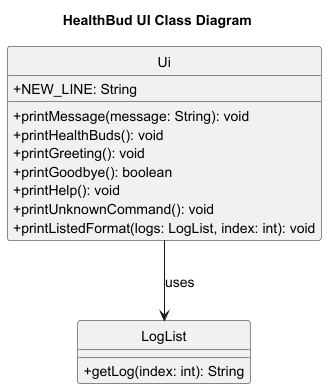
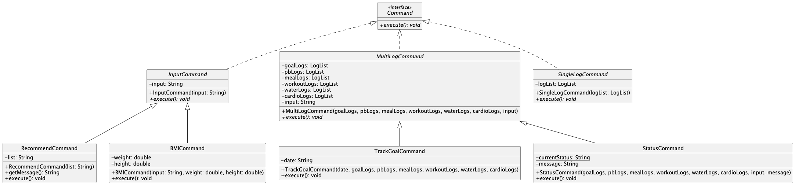
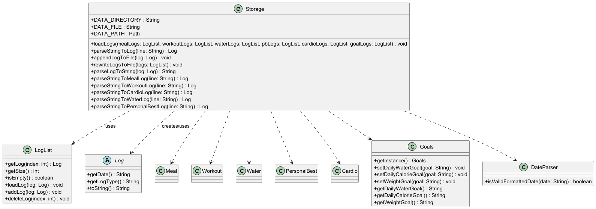
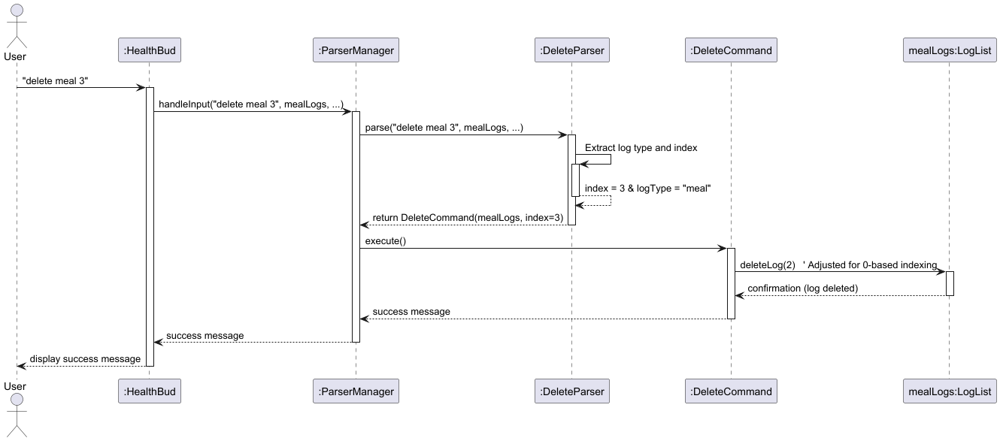
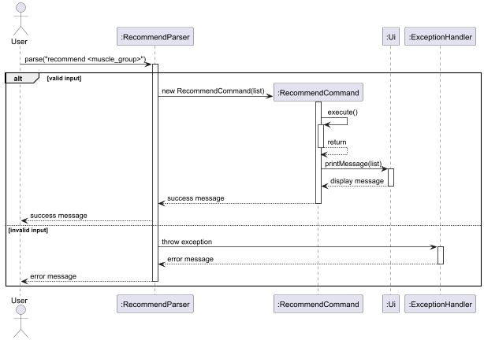
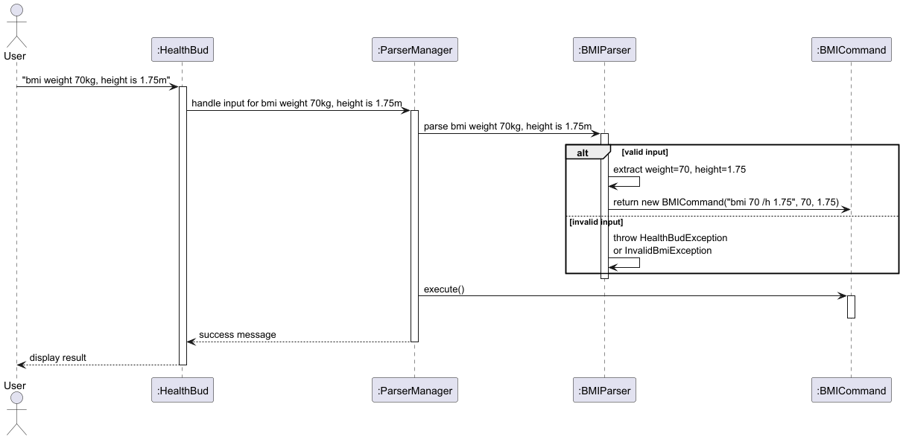

# Developer Guide

## Acknowledgements

This application was developed as part of a university software engineering module CS2113. Some ideas were adapted from:
1. Duke Java Project
2. JavaFX Documentation
3. Official Java 17 Documentation

## Design

### Architecture

The Architecture Diagram given above explains the high-level design of the HealthBud.

Given below is a quick overview of main components and how they interact with each other.

**Main Components**

`HealthBud` is in charge of the CLI to launch and the exit.

- At CLI launch, it initializes the other components in the correct sequence, and connects them up with each other.
- At exit, it shuts down the other components and invokes cleanup methods where necessary.

The bulk of the CLI's work id done by the following components:

- [**`UI`**](#ui): Responsible for displaying messages to the user.
- [**`Parser`**](#parser): Interprets user commands and constructs the corresponding `Command` objects.
- [**`Command`**](#command): Contains the logic for executing user commands.
- [**`LogList`**](#loglist): **(New)** Maintains lists for each log type (Meal, Workout, Water, etc.).
- [**`Storage`**](#storage): Handles reading and writing data to and from the hard disk.
- [**`Data`**](#data): Holds the in-memory data (logs) of the app.

### UI

  

- The UI component is responsible for user interactions. It handles displaying messages, prompts, and error messages to the user. 

### Parser

The Parser interface uses a series of classes to implement the various commands.

### Command

The Command interface defines the core execute() operation that all concrete commands must implement. 
Three abstract base classes (InputCommand, MultiLogCommand, and SingleLogCommand) implements this interface for different operational contexts:
- InputCommand handles simple commands requiring only user input (BMI calculations, recommendations)
- MultiLogCommand manages complex operations across multiple log types (goal tracking, status reports)
- SingleLogCommand processes actions targeting a specific log type

Key Characteristics:
- The abstract base classes enforce consistent parameter passing through their constructors
- Concrete commands like TrackGoalCommand and StatusCommand leverage multiple log types for cross-functional operations
- Input-focused commands (BMICommand, RecommendCommand) demonstrate minimal dependencies
- The hierarchy enables polymorphic command execution while maintaining strong type safety

### LogList

The LogList class manages a list of logs, each representing a fitness-related entry such as meals, workouts, water 
intake, cardio sessions, personal bests, or goals. It maintains a List<Log> and provides methods to add, delete, update,
list, and search through these logs.

- The abstract Log class is the superclass for all log types.
- Subclasses like Meal, Workout, Water, Cardio, PersonalBest, and Goals extend Log and store specific data for each log type.
- LogList has a one-to-many association with Log, represented by the contains relationship.
- The Goals class follows a singleton pattern via getInstance() and stores user-defined fitness goals.

This design promotes extensibility and encapsulation, allowing new log types to be added easily while maintaining a consistent interface.

### Storage
The Storage class manages HealthBud log persistence by reading and writing to a designated text file. It creates necessary directories and files, loads logs by parsing each line into specific types (Meal, Workout, etc.), and distributes them into corresponding LogLists. It also appends and rewrites logs using formatted string representations while handling errors gracefully.

# Implementation

## Add Log Command
The Add Log feature allows users to create and store different types of logs (e.g., workouts, meals, water intake) in HealthBud. 
This feature is handled by the AddCommand hierarchy, where each log type has a dedicated parser and command class for structured input validation and storage.

### 1. User Input:  
- The user enters a command in the following general format: ` add <log_type> 
 [parameters] `
- For example (Workout): ` add workout Benchpress /r 10 /s 3 /d 2023-12-25 /w 50 `

### 2. Command Parsing:  
1. ParserManager identifies the add command and extracts the log type (e.g., workout, meal).
2. AddParser routes parsing to the respective log-specific parser (e.g., AddWorkoutParser, AddMealParser).
3. Log-Specific Parser (e.g., AddWorkoutParser):
  - Extracts mandatory fields (e.g., exercise name, reps, date).
  - Validates numeric values (e.g., reps, weight).
  - Formats the date using DateParser (converts 2023-12-25 → 25 Dec 2023).
4. Returns a validated AddCommand object (e.g., AddWorkoutCommand).

### 3. Command execution 
1. AddCommand (e.g., AddWorkoutCommand):
- Creates a new log object (e.g., Workout("Benchpress", "10", "3", "25 Dec 2023", "50")).
- Passes the log to LogList for storage.
2. LogList:
- Adds the log to its internal list.
- Calls Storage.appendLogToFile(log) to save data persistently.

### 4. How the feature is implemented:  
1. Input Routing: ParserManager detects add → delegates to AddParser
2. Specialized Parsing: Log-specific parsers (AddWorkoutParser, etc.) extract and validate parameters
3. Standardization: DateParser converts dates to consistent format
4. Execution: Commands create log objects → LogList stores them → Storage saves to file
5. Feedback: UI confirms success with parsed details

### 6. Sequence Diagram

### 7. Design Rationale
1. Modular Parsers: Isolate validation logic per log type (avoids giant switch-case)
2. Early Validation: Fail before object creation (saves memory/CPU cycles)
3. Command Pattern: Keeps parsing separate from execution (cleaner testing)
4. Centralized Storage: LogList manages all persistence (single source of truth)

### 8. Alternatives considered:  
1. Inheritance-Based Logs was considered but it causes deep class hierarchy for different log types. Which Makes file storage and retrieval harder. 

3. UI Feedback:
- Confirms successful addition (e.g., "Added: Benchpress (3 sets of 50 kg for 10 reps) on 25 Dec 2023").

## Delete Log Command
The delete log feature allows users to remove a log by its index from the application's log list. This feature is handled by the `DeleteCommand` class, which performs validation, deletion, and error handling.

### 1. User Input:  
- The user enters the delete command followed by the log's index (e.g., `delete meal 3`).

### 2. Command Parsing:  
- The Parser converts the input into a `DeleteCommand` object, adjusting the index to match the list’s 0-based indexing. This process is handled by the `ParserManager` and the `DeleteParser.`

### 3. The `DeleteCommand` executes as follows:  
- Validation: Verifies whether the specified index is valid and corresponds to an existing meal log.
- Error Handling: If the index is invalid, an error message is returned to the user.
- Deletion: If the index is valid, the command retrieves the log’s details, removes the log from the Logs list, and generates a success message.

### 4. How the feature is implemented:  
- The deletion functionality is handled by the DeleteCommand class. It validates the user-provided index, adjusts it to match the 0-based indexing of the log list, and performs the deletion on the LogList object. This keeps the deletion logic isolated, making it easier to maintain and test.

### 5. Why it is implemented that way:  
- Using a dedicated command class follows the Command Pattern, which separates concerns effectively. Isolating deletion logic into its own class adheres to the Single Responsibility Principle, simplifying debugging and future enhancements without impacting other parts of the system.

### 6. Alternatives considered:  
- One alternative was to embed the deletion logic directly in the parser or UI layer. However, this approach would mix user input handling with business logic, resulting in code that is harder to maintain and test. Delegating deletion to a specialized command class keeps the design modular and scalable.

### Sequence Diagram

Diagram Explanation  

1. User Input:  
- The user enters `delete meal 3` in the CLI.

2. Parsing:  
- `HealthBud` receives the command and passes it to the `GeneralParser`.
- The `GeneralParser` calls `DeleteParser`, which extracts the log type ("meal") and the index (3). The index is then adjusted for 0-based indexing.
- A `DeleteCommand` object is created and returned to the `GeneralParser`.

3. Command Execution:  
- The `GeneralParser` invokes `execute()` on the `DeleteCommand`.
- The `DeleteCommand` calls `deleteLog(2)` on the `mealLogs` (since index 3 from the user corresponds to index 2 internally).
- The log is deleted from the `mealLogs`, and a success message is generated.

4. Outcome:  
- If the index is invalid, the command returns an error message.
- If the index is valid, the meal log is removed and a success message is displayed to the user.

This clear separation of user input, command parsing, and execution ensures that the deletion operation is handled in a structured and predictable manner.

## Recommend Command
The recommend <muscle_group> command provides users with 3 curated workout suggestions based on the specified muscle group, helping users diversify their fitness routines.

### 1. User Input:  
- The user enters the recommend command followed by a muscle group that they are interested in working out (e.g., `recommend biceps`).

### 2. Command Parsing:  

- The RecommendParser handles parsing and validation of the user input. 
- It checks that at least one argument (a muscle group) is present. 
- It uses a switch-case on the muscle group to determine the recommended exercises. 
- If the muscle group is unrecognized, it throws a HealthBudException with guidance.

### 3. The `RecommendCommand` executes as follows:  
- Once constructed, the RecommendCommand calls Ui.printMessage() with the appropriate recommendation message.
- The execute() method only handles display and does not contain logic beyond that.

### 4. How the feature is implemented:  
- The command string is split and validated in RecommendParser.
- A corresponding message for each muscle group is hardcoded into the switch-case.
- RecommendCommand simply wraps this message and prints it during execution.

### 5. Why it is implemented that way:  
- Separation of Concerns: Logic for parsing and message generation is in the parser, while command execution is kept simple and focused.
- Testability: Easy to write unit tests for RecommendParser without needing to simulate UI output.
- Readability: Clean execute() method and well-structured parser make the code intuitive and maintainable

### 6. Alternatives considered:  

- Enums for muscle groups: More structured but restrictive; dropped in favor of flexible string matching.
- External file storage for recommendations: Overhead for static data; current implementation is simpler and faster.

### Sequence Diagrams

Diagram Explanation  

1. User Input:  
- The user enters recommend <muscle_group> in the CLI.

2. Parsing:  
- RecommendParser parses the input and creates a RecommendCommand with a list of exercises.

3. Command Execution:  
- RecommendCommand.execute() is called. It sends the exercise list to Ui to display.

4. Outcome:  
An alt block handles:
- Valid Input: The recommended exercises are displayed and a success message is returned.
- Invalid Input: An exception is thrown and an error message is shown to the user.

This structure clearly separates parsing, command creation, and UI interaction for robust handling.

## BMI Command
The command calculates the user's Body Mass Index (BMI) based on the provided weight (in kilograms) and height (in meters), then categorizes the user as underweight, normal weight, overweight, or obese.

### 1. User Input:
- The user enters `bmi /w <weight> /h <height>` (e.g., `bmi /w 60 /h 1.70`).
- Weight must be a valid number representing kilograms.
- Height must be a valid number representing meters.

### 2. Command Parsing:
- **BMIParser** handles parsing and validation of the user input.
- It checks that:
   - The input is not null or empty.
   - The input contains a slash (`/`) separating weight and height.
   - Both weight and height can be parsed into valid numeric values.
- If any of these checks fail, an **InvalidBMIException** is thrown, prompting the user to correct their input format.

### 3. The `BMICommand` Executes as Follows:
- Once constructed with the valid weight and height, **BMICommand** calculates the BMI using the formula:
  \[
  \text{BMI} = \frac{\text{weight}}{(\text{height} \times \text{height})}
  \]
- The command then checks the BMI value and calls **Ui.printMessage()** with a message indicating whether the user is:
   - Underweight (BMI < 18.5)
   - Normal weight (18.5 ≤ BMI < 25)
   - Overweight (25 ≤ BMI < 30)
   - Obese (BMI ≥ 30)

### 4. How the Feature is Implemented:
- **BMIParser** extracts the numerical values for weight and height from the user input.
- It instantiates a **BMICommand** object with these parsed values.
- **BMICommand** performs the BMI calculation and categorization in its `execute()` method.
- The categorization strings are hardcoded for clarity and simplicity.

### 5. Why It Is Implemented That Way:
- **Separation of Concerns**: Parsing logic (e.g., checking for valid input and splitting the string) resides in **BMIParser**, while the command class focuses on calculation and message output.
- **Clarity**: Keeping the BMI formula and category checks in `execute()` makes it straightforward to read and maintain.
- **Testability**: This approach allows unit testing the parser separately from the command execution, ensuring each component is robust and reliable.

### 6. Alternatives Considered:
- **Single-Class Implementation**: Combining parsing and execution logic into one class would reduce the number of classes but make the code less organized and harder to maintain.
- **More Complex Validation**: Additional checks (e.g., extremely high or low values) could be added, but the current design focuses on standard BMI ranges and clear user prompts.
- **External Configuration**: Storing BMI thresholds or messages in an external file could add flexibility but also increase overhead for what is essentially static data.

5. Sequence Diagrams
   
   
Diagram Explanation  

The user inputs a BMI command with weight and height. HealthBud delegates parsing to BMIParser, which validates data and returns a BMICommand. The command calculates BMI and displays the result.

## Goals
### 1. User Input:

The user inputs the add goal command in the CLI, followed by optional parameters in any combination:
  `add goal /ml <water goal> /cal <calorie goal> /kg <weight goal>`. Each input is optional but at least ONE 
must be included.

### 2. Command Parsing:

The AddGoalParser class processes the command string:
- It first trims the "add goal" prefix.
- Then it parses the rest of the input into parameters using ParserParameters.parseParameters(input).
- It validates the input:
  - If none of /ml, /cal, or /kg are provided, it throws InvalidGoalException.
  - If a parameter is provided, it's converted to an integer and validated (e.g., water must be between 1 and 5000 ml).
- If all validations pass, it constructs and returns an AddGoalCommand instance with the correct values.

### 3. The `addGoalCommand` executes as follows:  
Once the AddGoalCommand object is created, its execute() method is called:
- It compares the user-provided values to the existing ones in the Goals singleton.
- If any value differs, it updates the goals using goal.updateGoals(...).
- The updated goal is printed via Ui.printMessage(...).
- The updated goal is appended to the storage file using Storage.appendLogToFile(...). modular and separate from
logging and UI logic

### 4. How the feature is implemented:  
The implementation consists of three core components:

1. Goals class: A singleton that holds goal-related state (water, calories, weight). It provides getter/setter methods
and ensures only one instance exists across the program.

2. AddGoalParser: Parses and validates user input. Handles defaulting of parameters.

3. AddGoalCommand: Takes parsed values and updates the singleton Goals object if necessary.

The feature relies on:

- Defensive programming (assert, exceptions)
- Centralized parsing via ParserParameters
- Clean separation between parsing and execution
### 5. Why It Is Implemented That Way:
- Singleton Pattern in Goals ensures consistency in goal state across commands and modules.

- Separation of concerns:

  - AddGoalParser handles user input.

  - AddGoalCommand handles goal logic and state change.

- Input flexibility: Users can update one, two, or all three goals in one command.

- Validation ensures robustness and prevents invalid states (e.g., negative water goal).

- Reusability: The Goals class can be reused for other commands (e.g., tracking weekly progress).

### 6. Alternatives Considered
- Command String Parsing in Command Class: Originally considered parsing parameters inside AddGoalCommand, but 
this would violate SRP (Single Responsibility Principle).

- Using multiple goal objects: Instead of a singleton, multiple Goals instances could be created per day. This was 
avoided to simplify the implementation and because the app tracks only one active goal set at a time.

- Current approach chosen for clarity, maintainability, and to align with overall project architecture and 
parser-command design pattern.

### 5. Sequence Diagrams

### 6. Future Improvements
- Input Validation: Use regex or stricter parsing to ensure only valid integers are accepted.
- Persistent Goal Storage: Store and reload goals from file or database to retain state between sessions.
- Multi-User Support: Refactor the singleton Goals class to support different profiles.
- Goal Recommendations: Use history from logs (e.g., average water intake) to suggest realistic goal values

## Product scope
### Target user profile

1. Fitness-conscious individuals
2. Users who prefer CLI-based tools
3. Individuals who want to log workouts, meals, water intake, and progress
4. Java users with basic terminal skills

### Value proposition

HealthBud provides a simple and effective CLI solution to track health logs including workouts, meals, water intake,
and personal bests. Unlike complex mobile apps, it runs offline and keeps the data lightweight and easily exportable.

## User Stories

|Version| As a ...           | I want to ...                                         | So that I can ...                                        |
|--------|-------------------|--------------------------------------------------------|-----------------------------------------------------------|
|v1.0   | new user           | see usage instructions                                | refer to them when I forget how to use the app           |
|v1.1   | user               | add workout logs                                      | track my workout progress                                |
|v1.2   | user               | record meal entries                                   | track calorie intake                                     |
|v1.3   | user               | input water logs                                      | ensure I stay hydrated                                   |
|v1.4   | user               | record my personal bests                              | see strength improvements over time                      |
|v2.0   | fitness enthusiast | get workout recommendations by muscle group          | try targeted exercises for specific body parts           |
|v2.1   | user               | calculate BMI                                         | know if I’m in a healthy weight range                    |
|v2.2   | user               | summarize daily intake                                | get a quick overview of my calories and hydration        |
|v2.3   | user               | view logs by date                                     | track my daily progress easily                           |
|v2.4   | user               | clear logs by category                                | declutter and keep only relevant data                    |
|v2.5   | user               | set fitness goals                                     | stay motivated and focused on my targets                 |

## Non-Functional Requirements

1. Should work on any platform with Java 17 or above
2. CLI response time under 1 second
3. Saves data locally in .txt file format
4. Commands should follow a consistent, predictable format
5. Lightweight and offline-capable (no external database or network dependency)

## Glossary

1. CLI – Command Line Interface
2. SUT – System Under Test
3. BMI – Body Mass Index
4. PB – Personal Best
5. Log – A record of user data (e.g., workout, meal, water)
6. Command – A user-triggered action that HealthBud performs
7. Parser – Component that interprets user input and returns a corresponding command

## Instructions for manual testing
### Prerequisites

1. Java 17 or later installed
2. HealthBud.jar built or downloaded

### Running the Program

1. Ensure that you have Java 17 or above installed.
2. Download the latest version of HealthBud from here.
3. Open a terminal and navigate to the folder where the application is located.
4. Run java -jar HealthBud.jar to start the application.
5. Start entering commands to log your fitness activities!
