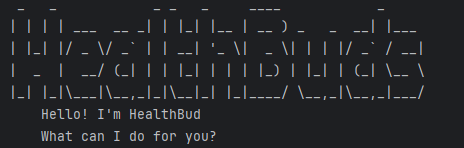

# User Guide

## Introduction

Welcome to HealthBud, your personal fitness companion! Whether you're tracking workouts, logging meals, monitoring water
intake, or recording personal bests (PBs), HealthBud makes fitness management simple and effective. With an intuitive 
command-line interface, you can easily log, view, and organize your fitness data.

HealthBud goes beyond basic tracking by helping you set and monitor fitness goals, calculate BMI, track your cutting 
or bulking progress, and even receive workout recommendations. Stay motivated and in control of your health journey with
HealthBud!

## Quick start
1. Ensure you have Java 17 or above installed in your Computer. You can download the latest version of Java from here.


2. Download the latest .jar file from [here](https://github.com/AY2425S2-CS2113-W13-4/tp/releases).


3. Copy the file to the folder you want to use as the home folder for HealthBud.


4. Open a command terminal, cd into the folder you put the jar file in, and use the `java -jar tp.jar` command to run the application.


5. Your command terminal should show the following:




6. WARNING: Pressing ctrl-c will terminate the program the same way as the bye command. 
   

7. Type the command in the command terminal and press Enter to execute it.


   Some example commands you can try:

- `add meal` chicken rice `/cal` 200 `/d` 02/02/2025 `/t` 1700: Adds a meal type task with description chicken rice, calories 200, date 02/02/2025 and time 1700 to the task tracker.


- `list workout`: Lists all workout logs.


- `delete water 1`: Deletes the water log with index 1.


- `bye`: Exits the app.


## Features

### 1. Help
Display this list of commands

Format: `help`

Example of usage: `help`
```
Here are the commands you can use:
1. help - Display this list of commands
2. bye - Exit the program
3. recommend <muscle_group> - Get workout recommendations
4. bmi /w <weight_in_kg> /h <height_in_m> - Calculate your BMI
5. add workout <exercise> /w <weight in kg> /r <reps> /s <sets> /d <DD/MM/YYYY> - Add a workout log
6. add meal <meal_name> /cal <calories> /d <DD/MM/YYYY> /t <HHmm> - Add a meal log
7. add water /ml <volume> /d <DD/MM/YYYY> /t <HHmm> - Add a water log
8. add pb <exercise> /w <weight_in_kg> /d <DD/MM/YYYY> - Record a personal best
9. add cardio <exercise> /s <speed> /i <incline> /t <duration_in_min> /d <DD/MM/YYYY> - Add a cardio log
10. sum <cal|vol|cardio> /d <DD/MM/YYYY> - Sum up the total calories/water for the day
11. clear <pb|meal|workout|water> - Clear the respective log
12. view goals - to view all goals
13  add goal /ml <waterGoals /cal <calorieGoals> /kg <weightGoals> - to edit your personal goals
14. track goal /d <DD/MM/YYYY> - to track personal goals
15. status change <cutting/bulking> - Update your cutting/bulking status
16. status report - View your current cutting/bulking progress
17. search <logType> /d <DD/MM/YYYY> OR search <logType> /k <keyword> - Search for logs
18. list <logType> - List all logs for that specific log type
19. delete <logType> <index> - Delete specific index in the log
``` 

### 2. Bye
Exit the program

Format: `bye`

Example of usage: `bye`
```
Bye! Hope to see you again soon!
```

### 3. Recommend
Get workout recommendations for a specific muscle group.

Format: `recommend <muscle_group>`

Example of usage: `recommend biceps`
```
Here are some recommended biceps exercises:
 1. Barbell Bicep Curls
 2. Hammer Curls
 3. Cable Curls
``` 

### 4. BMI
Calculate your BMI and tells user if they are underweight, normal weight, overweight or obese. <BR/>

Range of accepted Weight: 1.5kg - 700kg

Range of accepted Height: 0.2m - 3.0m

Format: `bmi /w <weight_in_kg> /h <height_in_m>`

Example of usage: `bmi /w 75 /h 1.8`
```
Your BMI is: 23.15, you are of normal weight.
``` 

### 5. Add workout
Adds a workout log with the exercise name, weight lifted, number of reps, number of sets, and date.

Range of accepted weight: 1kg - 1000kg

Range of accepted reps: 1 - 1000

Range of accepted sets: 1 - 100

Format: `add workout <exercise> /w <weight in kg> /r <reps> /s <sets> /d <DD/MM/YYYY>`

Example of usage: `add workout bench /w 100 /r 8 /s 3 /d 02/02/2025`
```
 Got it. I've added this log:workout
  bench (3 sets of 100 kg for 8 reps) on 02 Feb 2025
 Now you have 22 workout logs in the list.
``` 

### 6. Add meal
Adds a meal log with the meal name, calories, date, and time.

Range of accepted calories: 1 - 10000

Format: `add meal <meal_name> /cal <calories> /d <DD/MM/YYYY> /t <HHmm>`

Example of usage: `add meal chicken rice /cal 200 /d 02/02/2025 /t 1700`
```
 Got it. I've added this log:meal
  chicken rice (200 cal) on: 02 Feb 2025 at: 1700
 Now you have 1 meal logs in the list.
``` 

### 7. Add water
Adds a water log with the volume in ml, date, and time.

Range of accepted volume: 1ml - 10000ml

Format: `add water /ml <volume> /d <DD/MM/YYYY> /t <HHmm>`

Example of usage: `add water /ml 1000 /d 02/02/2025 /t 1700`
```
 Got it. I've added this log:water
  4.0 glass of water on (02 Feb 2025) at 1700
 Now you have 1 water logs in the list.
``` 

### 8. Add Personal Best
Record a personal best log with the exercise name, weight lifted, and date.

Range of accepted weight: 1kg - 1000kg

Format: `add pb <exercise> /w <weight_in_kg> /d <DD/MM/YYYY>`

Example of usage: `add pb bench /w 120 /d 02/02/2025`
```
 Got it. I've added this log:pb
   bench 120 kg on (02 Feb 2025)
 Now you have 1 pb logs in the list.
``` 

### 9. Add Cardio
Add a cardio log with the exercise name, speed, incline, duration, and date.

Speed
- Range: 1 - 50 
- Units: kilometers per hour (km/h)

Incline
- Range: 0 - 15 
- Units: percentage
- Description: Indicates the incline grade, where a 1% incline represents a 1-unit rise in height for every 100 units of horizontal distance.

Duration
- Range: 1 - 1440 
- Units: minutes

Format: `add cardio <exercise> /s <speed> /i <incline> /t <duration> /d <DD/MM/YYYY>`

Example of usage: `add cardio run /s 8 /i 5 /t 30 /d 02/02/2025`
```
 Got it. I've added this log:cardio
  run (speed: 8, incline: 5, duration: 30 mins) on 02 Feb 2025
 Now you have 1 cardio logs in the list.
``` 

### 10. Sum
Sum up the total calories/water for the day

Format: `sum <cal|vol|cardio> /d <DD/MM/YYYY>`

Example of usage: `sum cal /d 02/02/2025`
``` 
Total calories consumed: 500
``` 
The formula used to calculate calories burned from `sum cardio /d 01/01/24` is as follows:
Estimated calories burned = ((speed * 2) + (incline * 5)) * (duration / 60.0) * 100

### 11. Clear
Clear the respective log

Format: `clear <pb|meal|workout|water>`

Example of usage: `clear meal`
``` 
Noted. I've removed all logs.
```

### 12. View goal
View current goals 

Format: `view goal`

Example of usage: `view goal`

``` 
    Here are your current goals: 
    Daily Water Goal: Not set yet
    Daily Calorie Goal: Not set yet
    Weight Goal: Not set yet

    What goal would you like to add today?
``` 

### 13. Add goal
Able to add/edit your list of Goals, not necessary for all parameters to be inputted at once!

Goals cannot be set as 0, cleared or deleted, only updated. This is to encourage users to set goals and stick to them.

Water goal accepted range: 1 - 10000 ml
Calorie goal accepted range: 1 - 20000 ml
Body weight goal accepted range: 1 - 700 kg

Format: `add goal /ml <waterGoals> | /cal <calorieGoals> | /kg <weightGoals>`

Example of usage: `add goal /ml 1500 /cal 2000 /kg 70`
``` 
Goal has been updated:
Daily Water Goal: 1500 ml
Daily Calorie Goal: 2000 cal
Weight Goal: 70 kg 
``` 

### 14. Track goal
Track your current progress for goals

Format: `track goal /d <DD/MM/YYYY>`

Example of usage: `track goals /d 02/02/2025`
``` 
    Here is your goal progress for 2 Feb 2025: 

    Total water consumed: 4000ml
    Total calories consumed: 2000cal
```

### 15. Status Change
Update your cutting/bulking status

Format: `status change <cutting|bulking>`

Example of usage: `status change bulking`
``` 
Status updated to: bulking
``` 

### 16. Status report
View your current cutting/bulking progress

Format: `status report <DD/MM/YYYY>`

Example of usage: `status report 26/12/2023`
``` 
Total calories consumed: 2300
Total calories burned: 790
Current Status: bulking
Your intake does not align with your goal. Net calories: 500
``` 

### 17. Search Keywords / Date
Search for logs by keywords or date

Format: `search <loglist> /k <keyword>` OR `search <loglist> /d <DD/MM/YYYY>`

Example of usage: `search workout /k bench` OR `search meal /d 6/5/2025`(search for all meals on 5th June 2025)
``` 
Showing logs containing keyword: bench
1. bench press (4 sets of 60 kg for 8 reps) on 26 Dec 2023
3. bench press (4 sets of 65 kg for 9 reps) on 31 Dec 2023
5. bench press (4 sets of 69 kg for 4 reps) on 10 Jan 2024
``` 

### 18. List log
List a specific log

Format: `list <logType>`

Example of usage: `list pb`
```
Got it, here are your logs:
1.  bench 80 kg on (21 Mar 2025)
2.  squat 140 kg on (21 Mar 2025)
```

### 19. Delete log
Delete specific index in the log

Format: `delete <logType> <index>`

Example of usage: `delete pb 2`
```
Noted. I've removed this log:
bench 80 kg on (21 Mar 2025)
Now you have 6 logs in the list.
```

## Saving Data
HealthBud saves your task data in a text file located at ./data/healthbud. 
This file is automatically updated whenever you add, delete, or modify logs. 
You can view or edit this file using any text editor.

## Date Format
- HealthBud accepts dates in the format DD/MM/YY, DD/MM/YYYY, DD-MM-YY, DD-MM-YYYY, DD MM YYYY.
- Product considers 11 April 2025 as current date.

## Command Summary
| Command             | Format, Example                                                                                                                         |
|---------------------|:----------------------------------------------------------------------------------------------------------------------------------------|
| ```help```          | ```help```                                                                                                                              |
| ```bye```           | ```bye```                                                                                                                               |
| ```recommend```     | recommend [muscle_group] <br/> e.g ```recommend biceps```                                                                               |
| ```bmi```           | bmi /w [weight_in_kg] /h [height_in_m] <br/> e.g ```bmi /w 75 /h 1.8```                                                                 |
| ```add workout```   | add workout [exercise] /w [weight in kg] /r [reps] /s [sets] /d [date] <br/> e.g ```add workout bench /w 100 /r 8 /s 3 /d 02/02/2025``` |
| ```add meal```      | add meal [meal_name] /cal [calories] /d [date] /t [time] <br/> e.g ```add meal chicken rice /cal 200 /d 02/02/2025 /t 1700```           |
| ```add water```     | add water /ml [volume] /d [date] /t [time] <br/> e.g ```add water /ml 1000 /d 02/02/2025 /t 1700```                                     |
| ```add pb```        | add pb [exercise] /w [weight_in_kg] /d [date] <br/> e.g ```add pb bench /w 120 /d 02/02/2025```                                         |
| ```add cardio```    | add cardio [exercise] /s [speed] /i [incline] /t [duration] /d [date] <br/> e.g ```add cardio run /s 8 /i 5 /t 30 /d 02/02/2025```      |
| ```sum```           | sum [cal/vol/cardio] /d [date] <br/> e.g ```sum cal /d 02/02/2025```                                                                    |
| ```clear```         | clear [pb\|meal\|workout\|water] <br/> e.g ```clear meal```                                                                             |
| ```view goal```     | view goal <br/> e.g ```view goal```                                                                                                     |
| ```add goal```      | add goal /ml [waterGoals] /cal [calorieGoals] /kg [weightGoals] <br/> e.g ```add goal /ml 2000 /cal 3000 /kg 70```                      |
| ```track goal```    | track goal /d [date] <br/> e.g ```track goal /d 02/02/2025```                                                                           |
| ```status change``` | status change [cutting\|bulking] <br/> e.g ```status change bulking```                                                                  |
| ```status report``` | status report [date] <br/> e.g ```status report 26/12/2023```                                                                           |
| ```search```        | search [logType] /k [keyword] OR search [logType] /d [date] <br/> e.g ```search workout /k bench```                                     |
| ```list```          | list [logType] <br/> e.g ```list pb```                                                                                                  |
| ```delete```        | delete [logType] [index] <br/> e.g ```delete pb 2```                                                                                    |
